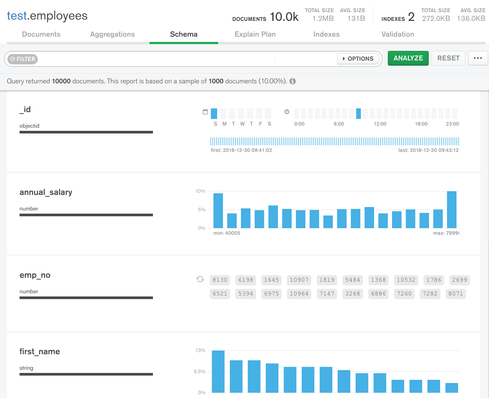
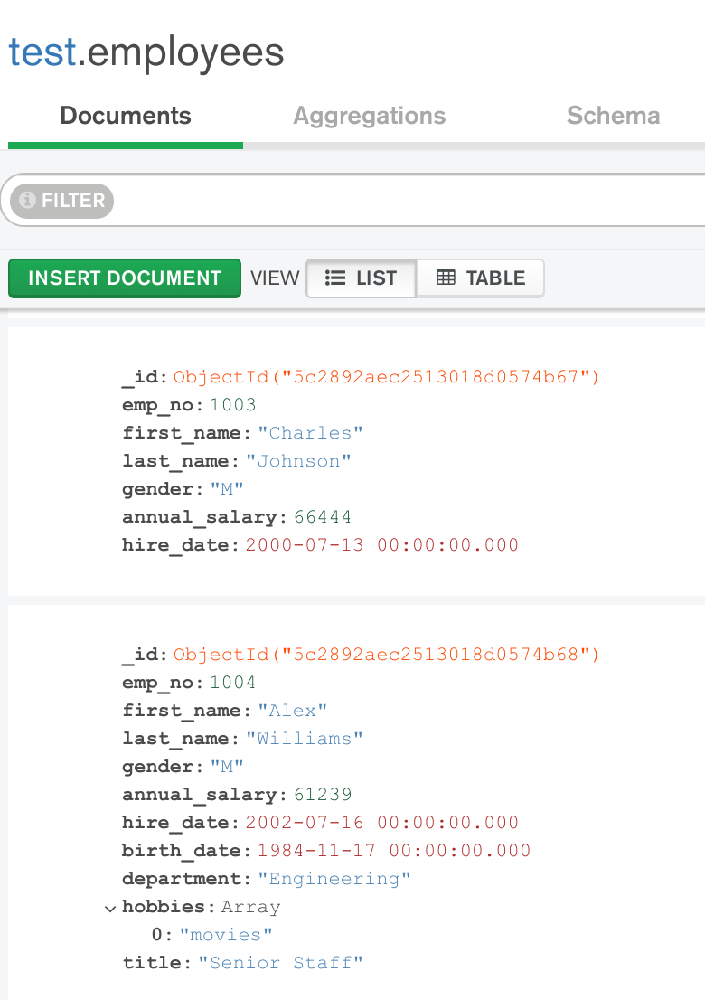

# FLEXIBLE

__Ability to make ‘in-place’ data model changes to a live database without requiring planned downtime for the database or consuming applications__

__SA Maintainer__: [Alejandro Mancilla](mailto:alejandro.mancilla@mongodb.com) <br/>
__Time to setup__: 15 mins <br/>
__Time to execute__: 15 mins <br/>


---
## Description

This proof shows how MongoDB can provide a flexible data model (a.k.a. flexible schema) enabling the structures of some existing records to be enhanced with additive changes (e.g. new attributes, new sub-documents), without breaking existing applications (e.g. microservices) and without requiring downtime. This shows how MongoDB can be used to support ever changing agile applications over time, where the database needs to effectively support business change.

For this proof, a set of randomly generated employee records are used, and two continuously running scripts are run, whilst changes to the data model are dynamically made, to simulate two running microservices that are consuming the database's data.


---
## Setup
__1. Configure Laptop__
* Ensure MongoDB version 3.6+ is already installed your laptop, mainly to enable MongoDB command line tools to be used (no MongoDB databases will be run on the laptop for this proof)
* [Download](https://www.mongodb.com/download-center/compass) and install Compass on your laptop
* Ensure your laptop can run __Python 3__ - please follow the installation steps for your operating system and version as described in the [Python setup and usage](https://docs.python.org/3/using/index.html) guide
* Ensure the Python libraries __pymongo__ and __dnspython__ are installed, e.g.:
  ```bash
  pip3 install pymongo[srv]
  ```

__2. Configure Atlas Environment__
* If using standard remote demo environment, use this doc and skip these instructions. https://docs.google.com/document/d/1cWyqMbJ_cQP3j7S4FJQhjRRiKq9WPfwPG6BmJL2bMvY/edit
* Log-on to your [Atlas account](http://cloud.mongodb.com) (using the MongoDB SA preallocated Atlas credits system) and navigate to your SA project
* In the project's Security tab, choose to add a new user called __main_user__, and for __User Privileges__ specify __Read and write to any database__ (make a note of the password you specify)
* Create an __M10__ based 3 node replica-set in a single cloud provider region of your choice with default settings
* In the Security tab, add a new __IP Whitelist__ for your laptop's current IP address
* In the Atlas console, for the database cluster you deployed, click the __Connect button__, select __Connect Your Application__, and for the __latest Python version__  copy the __Connection String Only__ - make a note of this MongoDB URL address to be used later

---
## Execution

* Overwrite the following variables in the [demo_settings.py](demo_settings.py) python script file on your local filesystem, with the values of your Atlas URI string (including both username & password).
  ```
  URI_STRING = "YOUR_ATLAS_URI_STRING"
  NUM_ITEMS = 10000
  NUM_SAMPLING = 1000
  DB_NAME = "FLEXIBLE"
  COLLECTION_NAME = "employees"
  ```
* From a terminal/shell, execute the custom script to generate and pre-load *NUM_ITEMS* records into the collection _employees_ of the database __FLEXIBLE__ running in the Atlas cluster (note, if a collection of this name already exists, the script will first delete it, before recreating it):
  ```bash
  ./create_model.py
  ```

* From the Atlas console, click the __Connect button__, select __Connect With MongoDB Compass__ and click the __Copy__ button to copy the connection string, then launch Compass, select to use the __MongoDB Connection String__ detected from the clipboard, fill in the __Password__ field and once connected show the contents of the __FLEXIBLE.employees__ collection in both the __Documents__ tab and __Schema__ tab of Compass



* Open a new terminal/shell and execute a simple script for simulating an existing microservice which queries and prints out the already understood attributes of the employee records only:
  ```bash
  ./microservice_one.py
  ```

* Now, execute a custom script which adds fields (e.g. *department*, *birth_date*) and sub-documents (e.g. *hobbies*) to a random *NUM_SAMPLING* subset of the existing employee records in the database:
  ```bash
  ./alter_model.py
  ```

* Using Compass, show that the structure for some of the employee records has changed


* Look back in the terminal/shell running the first microservice, *microservice_one.py*, and notice that this service is still operating fine despite the underlying data model having changes for some of the records

* Now open a new terminal/shell and execute a simple script simulating a newly added microservice which queries and uses some of the existing attributes of each record + some of the new attributes unique to the newly added sub-documents only (not all existing records will contain the new sub-document):
  ```bash
  ./microservice_two.py
  ```


---
## Measurement

By showing the continuous terminal/shell output, you can explain  throughout whole execution process, that first microservice continues to run successfully despite data model changes have been applied to documents in collection of employeees. Explain that current running script does not break and continues to successfully run during and after addition of the new attributes and sub-documents. Finally,  show second microservice working perfectly and retrieves all the data attributes it requires (both original data attributes and also newly added ones).

Please be sure to drop the collections at the end of your PoV.
```bash
./clean_environment.py
```
